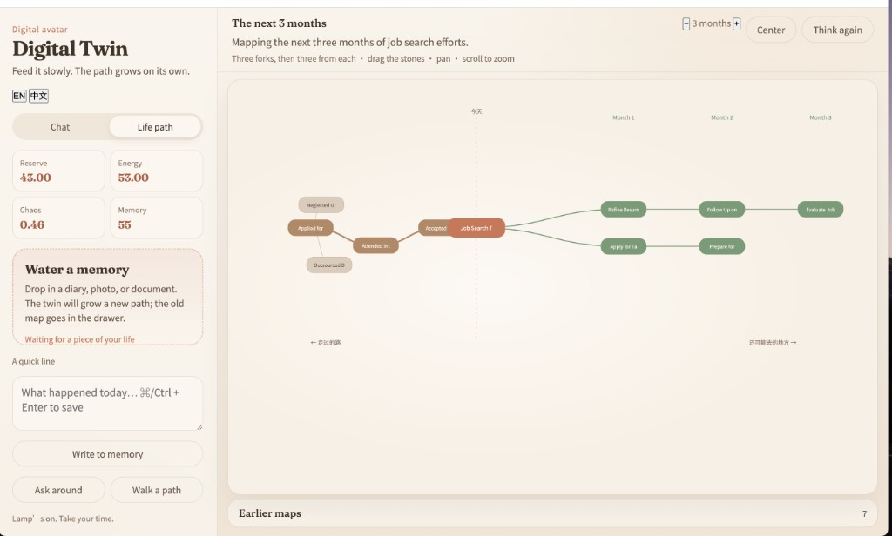

# Digital Twin

<p align="center">
  
</p>

<p align="center">
  <strong>Feed it slowly. The path grows on its own.</strong><br />
  A local digital avatar with memory you <em>water</em>, a physical state machine, and a branching life-path map.
</p>

<p align="center">
  <a href="https://zhouyyj.github.io/digital-twin/">Preview page</a> ·
  <a href="#setup">Run locally</a>
</p>

---

Use it from the **terminal** or the **local website** (drag-and-drop watering + streamed chat).

## What you get

| | |
|---|---|
| **Water memory** | Drop diaries, PDFs, images — chunked into local Chroma embeddings |
| **Chat** | Streamed twin replies; mention “deduce” / “choose” to count the cost |
| **Life path** | Custom 2–6 months; 3 forks, then 3 from each; pebble nodes you can drag and edit |
| **History** | After watering, the old map archives into a drawer |
| **Sandbox** | Board debate and month-by-month simulation |

The UI is English-only.

## Setup

```bash
python3 -m venv venv
source venv/bin/activate
pip install -r requirements.txt
cp .env.example .env
# edit .env → set OPENAI_API_KEY
```

### Website (recommended)

```bash
uvicorn server:app --reload --port 8787
```

Open [http://127.0.0.1:8787](http://127.0.0.1:8787)

- Drag diaries / PDFs / images onto **watering**
- Chat in **small talk**
- Open **roadmap** for past / today / future branches (regenerates after watering; old trees stay in history)
- Use **− / +** to change horizon months; **Think again** to redraw
- Drag pebble nodes; click to edit label and detail

### Terminal CLI

```bash
python main.py
```

## Phases

| Phase | What |
|-------|------|
| 0 | Terminal loop, Colorama, streamed OpenAI replies |
| 1 | Event-sourced memory (`MemoryManager` + ChromaDB) |
| 2 | Physical state machine (`state.json`, deduction intercepts) |
| 3 | Cognitive sandbox (`/board`, `/simulate`) |
| 4 | Personal watering (`/water` or web drag-drop) |
| 5 | Local web UI (`server.py` + `web/`) |

## CLI commands

- Chat normally — the twin streams back
- `/state` — capital / energy / entropy_rate
- `/memory` — how many events are in the local store
- `/board [dilemma]` — three-director debate with memory citations
- `/simulate [choice]` — stepped path with entropy friction
- `/water <path>` — feed a file or directory
- `/water note: …` — feed an inline diary line
- `/feed …` — alias of `/water`

## Watering

Nothing is scraped in the background. You explicitly pour material in via CLI or by dropping files on the site.

- Text / markdown / diary → chunked embeddings
- PDF / Word → text extracted, then chunked
- Images → vision caption stored as `Image_Artifact`

## GitHub preview

- **README** — screenshot above (`docs/preview.png`)
- **GitHub Pages** — enable *Settings → Pages → Build from branch `main`, folder `/docs`* → live at `https://zhouyyj.github.io/digital-twin/`

Replace `docs/preview.png` anytime with a fresh screenshot of your local UI.
